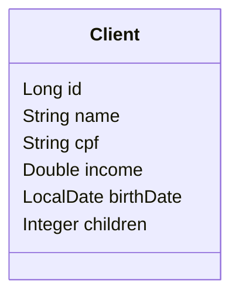

# Desafio: API REST, Camadas, CRUD, Exceções e Validações

Este repositório contém a resolução do desafio **CRUD de Clientes**, desenvolvido no capítulo 3 do curso **Java Spring Professional**.

O projeto tem como objetivo praticar a construção de uma **API REST** com **Spring Boot**, organizada em camadas, utilizando **Spring Data JPA**, **Hibernate**, banco de dados **H2**, operações CRUD, tratamento de exceções e validação de dados com **Bean Validation**.

## Sobre o desafio

O desafio propõe a criação de um projeto Spring Boot contendo um CRUD completo de web services REST para acessar o recurso de clientes.

A aplicação deve permitir:

- Buscar clientes de forma paginada;
- Buscar um cliente por id;
- Inserir um novo cliente;
- Atualizar um cliente existente;
- Deletar um cliente existente.

Cada cliente possui:

- Nome;
- CPF;
- Renda;
- Data de nascimento;
- Quantidade de filhos.

Além das operações CRUD, o projeto também exige a configuração de um ambiente de testes com banco de dados H2, carga inicial de dados com `import.sql`, tratamento de exceções e validação dos dados enviados nas requisições.

## O que foi cobrado

O desafio solicitava que a solução fosse desenvolvida em **Java com Spring Boot**, utilizando **Maven** como gerenciador de dependências e **H2** como banco de dados em memória para testes.

A aplicação deveria conter:

- Um novo projeto Spring Boot;
- Uma entidade `Client` com os atributos definidos no enunciado;
- Um recurso REST disponível em `/clients`;
- Busca paginada de clientes;
- Busca de cliente por id;
- Inserção de novo cliente;
- Atualização de cliente existente;
- Deleção de cliente existente;
- Carga inicial com pelo menos 10 clientes significativos;
- Tratamento de erro `404 Not Found` para id inexistente;
- Tratamento de erro `422 Unprocessable Content` para dados inválidos;
- Mensagens customizadas para os campos inválidos;
- Validação para nome não vazio;
- Validação para data de nascimento não futura.

## Modelo de domínio

O domínio do projeto foi organizado em torno da entidade `Client`.



A entidade representa um cliente cadastrado na aplicação, contendo seus dados pessoais e informações utilizadas nas operações da API.

## Estrutura do projeto

A solução foi organizada seguindo o padrão de camadas apresentado no capítulo.

```text
src/main/java/com/devsuperior/desafio3
├── controllers
│   ├── ClientController.java
│   └── handlers
│       └── ControllerExceptionHandler.java
├── dto
│   ├── ClientDTO.java
│   ├── CustomError.java
│   ├── FieldMessage.java
│   └── ValidationError.java
├── entities
│   └── Client.java
├── repositories
│   └── ClientRepository.java
├── services
│   ├── ClientService.java
│   └── exceptions
│       ├── DatabaseException.java
│       └── ResourceNotFoundException.java
└── Desafio3Application.java
```

## Camadas da aplicação

### Controller

A camada de controller é responsável por expor os endpoints da API REST e receber as requisições HTTP.

No projeto, a classe `ClientController` disponibiliza o recurso `/clients` e implementa as operações:

- `GET /clients`: busca paginada de clientes;
- `GET /clients/{id}`: busca de cliente por id;
- `POST /clients`: inserção de novo cliente;
- `PUT /clients/{id}`: atualização de cliente existente;
- `DELETE /clients/{id}`: deleção de cliente existente.

Essa camada trabalha com objetos DTO e delega as regras da aplicação para a camada de serviço.

### Service

A camada de service é responsável por concentrar as regras de negócio e coordenar as operações entre controller, repository e entidade.

No projeto, a classe `ClientService` implementa os métodos de:

- Inserção;
- Busca por id;
- Busca paginada;
- Atualização;
- Deleção.

Também é nessa camada que são lançadas exceções customizadas quando um recurso não é encontrado ou quando ocorre erro de integridade no banco de dados.

### Repository

A camada de repository é responsável pelo acesso ao banco de dados.

No projeto, a interface `ClientRepository` estende `JpaRepository<Client, Long>`, herdando os métodos necessários para persistência, busca, paginação, atualização e deleção dos registros.

```java
public interface ClientRepository extends JpaRepository<Client, Long> {
}
```

## Entidade Client

A classe `Client` representa a tabela `tb_client` no banco de dados.

Ela contém os seguintes atributos:

- `id`: identificador do cliente;
- `name`: nome do cliente;
- `cpf`: CPF do cliente;
- `income`: renda do cliente;
- `birthDate`: data de nascimento;
- `children`: quantidade de filhos.

A entidade foi mapeada com as anotações JPA:

```java
@Entity
@Table(name = "tb_client")
public class Client {
    @Id
    @GeneratedValue(strategy = GenerationType.IDENTITY)
    private Long id;
}
```

O campo `birthDate` é convertido automaticamente pela JPA para a coluna `birth_date` no banco de dados, seguindo o padrão de conversão de camelCase para snake_case.

## DTO

A classe `ClientDTO` foi criada para transferir dados entre a API e as demais camadas da aplicação.

O uso de DTO evita expor diretamente a entidade JPA nas requisições e respostas da API, além de permitir aplicar validações nos dados recebidos.

O DTO contém os mesmos dados principais da entidade:

- `id`;
- `name`;
- `cpf`;
- `income`;
- `birthDate`;
- `children`.

Também foram adicionadas validações com Bean Validation, como:

```java
@NotBlank(message = "The name must not be blank!")
private String name;

@PastOrPresent(message = "The birth date must not be a future date!")
private LocalDate birthDate;
```

## Endpoints da API

### Buscar clientes com paginação

```http
GET /clients?page=0&size=6&sort=name
```

Retorna uma página de clientes ordenada pelo nome.

### Buscar cliente por id

```http
GET /clients/1
```

Retorna o cliente correspondente ao id informado.

Caso o id não exista, a API retorna `404 Not Found`.

### Inserir novo cliente

```http
POST /clients
Content-Type: application/json
```

Exemplo de corpo da requisição:

```json
{
  "name": "Maria Silva",
  "cpf": "12345678901",
  "income": 6500.0,
  "birthDate": "1994-07-20",
  "children": 2
}
```

Quando a inserção é realizada com sucesso, a API retorna `201 Created`.

### Atualizar cliente

```http
PUT /clients/1
Content-Type: application/json
```

Exemplo de corpo da requisição:

```json
{
  "name": "Maria Silvaaa",
  "cpf": "12345678901",
  "income": 6500.0,
  "birthDate": "1994-07-20",
  "children": 2
}
```

Quando a atualização é realizada com sucesso, a API retorna `200 OK`.

Caso o id não exista, a API retorna `404 Not Found`.

### Deletar cliente

```http
DELETE /clients/1
```

Quando a deleção é realizada com sucesso, a API retorna `204 No Content`.

Caso o id não exista, a API retorna `404 Not Found`.

## Tratamento de exceções

O projeto utiliza uma classe `ControllerExceptionHandler`, anotada com `@ControllerAdvice`, para centralizar o tratamento de exceções da API.

Foram tratados os seguintes cenários:

### Recurso não encontrado

Quando um cliente não é encontrado, a aplicação lança uma `ResourceNotFoundException`.

A resposta retorna o status:

```http
404 Not Found
```

Exemplo de resposta:

```json
{
  "timestamp": "2026-05-12T19:30:00Z",
  "status": 404,
  "error": "Resource not found!",
  "path": "/clients/999"
}
```

### Erro de validação

Quando os dados enviados na requisição são inválidos, a API retorna:

```http
422 Unprocessable Content
```

Exemplo de resposta:

```json
{
  "timestamp": "2026-05-12T19:30:00Z",
  "status": 422,
  "error": "Invalid data",
  "path": "/clients",
  "errors": [
    {
      "fieldName": "name",
      "message": "The name must not be blank!"
    },
    {
      "fieldName": "birthDate",
      "message": "The birth date must not be a future date!"
    }
  ]
}
```

### Erro de banco de dados

O projeto também possui uma exceção customizada `DatabaseException`, utilizada para representar erros relacionados à integridade dos dados.

## Validações implementadas

As validações foram implementadas na classe `ClientDTO` com Bean Validation.

Principais validações:

- `name`: não pode estar em branco;
- `cpf`: não pode estar em branco e deve possuir até 11 caracteres;
- `income`: deve ser zero ou positivo;
- `birthDate`: não pode ser uma data futura;
- `children`: deve ser zero ou positivo.

Essas validações são acionadas nos endpoints de inserção e atualização por meio da anotação `@Valid`.

## Seeding da base de dados

A carga inicial dos dados foi feita por meio do arquivo `import.sql`, localizado na pasta `src/main/resources`.

O script insere 20 clientes com dados significativos, permitindo testar a busca por id, listagem paginada, ordenação e demais operações da API.

Ao executar a aplicação, o Hibernate cria a tabela `tb_client` automaticamente e executa o script de importação.

## Tecnologias utilizadas

- Java
- Spring Boot
- Spring Web
- Spring Data JPA
- Hibernate
- H2 Database
- Maven
- Bean Validation
- API REST
- Programação orientada a objetos

## Como executar o projeto

Clone o repositório:

```bash
git clone git@github.com:klesleySilvaOliveira/ds-jsp-desafio-3.git
```

Acesse a pasta do projeto:

```bash
cd ds-jsp-desafio-3
```

Execute a aplicação no Linux ou macOS:

```bash
./mvnw spring-boot:run
```

No Windows PowerShell:

```bash
.\mvnw spring-boot:run
```

## Acessando o banco H2

Após iniciar a aplicação, acesse o H2 Console no navegador:

```text
http://localhost:8080/h2-console
```

Utilize os dados de conexão configurados no projeto:

```text
JDBC URL: jdbc:h2:mem:testdb
User Name: sa
Password:
```

Depois de conectar, é possível consultar a tabela criada automaticamente:

- `tb_client`

## Exemplos de consultas no H2

Listar todos os clientes:

```sql
SELECT * FROM tb_client;
```

Buscar cliente por id:

```sql
SELECT * FROM tb_client WHERE id = 1;
```

Listar clientes em ordem alfabética:

```sql
SELECT * FROM tb_client ORDER BY name;
```

Consultar nome, CPF e renda dos clientes:

```sql
SELECT 
    name,
    cpf,
    income
FROM tb_client;
```

Consultar clientes com renda maior ou igual a 5000:

```sql
SELECT 
    id,
    name,
    cpf,
    income,
    birth_date,
    children
FROM tb_client
WHERE income >= 5000
ORDER BY income DESC;
```

## Testes manuais sugeridos

Após executar a aplicação, é possível testar os endpoints com Postman, Insomnia ou outra ferramenta de requisições HTTP.

### Busca paginada

```http
GET http://localhost:8080/clients?page=0&size=6&sort=name
```

### Busca por id

```http
GET http://localhost:8080/clients/1
```

### Inserção

```http
POST http://localhost:8080/clients
Content-Type: application/json
```

```json
{
  "name": "Maria Silva",
  "cpf": "12345678901",
  "income": 6500.0,
  "birthDate": "1994-07-20",
  "children": 2
}
```

### Atualização

```http
PUT http://localhost:8080/clients/1
Content-Type: application/json
```

```json
{
  "name": "Maria Silvaaa",
  "cpf": "12345678901",
  "income": 6500.0,
  "birthDate": "1994-07-20",
  "children": 2
}
```

### Deleção

```http
DELETE http://localhost:8080/clients/1
```

## Conceitos praticados

Este projeto reforça conceitos importantes para o desenvolvimento de APIs REST com Spring Boot:

- Criação de projeto Spring Boot;
- Organização da aplicação em camadas;
- Criação de controller REST com `@RestController`;
- Mapeamento de recurso com `@RequestMapping`;
- Uso dos verbos HTTP `GET`, `POST`, `PUT` e `DELETE`;
- Uso de `ResponseEntity`;
- Retorno de status HTTP adequados;
- Criação de entidade JPA com `@Entity`;
- Mapeamento de tabela com `@Table`;
- Definição de chave primária com `@Id` e `@GeneratedValue`;
- Criação de repository com `JpaRepository`;
- Uso de service com `@Service`;
- Controle transacional com `@Transactional`;
- Busca paginada com `Page` e `Pageable`;
- Uso de DTO para transferência de dados;
- Conversão manual entre entidade e DTO;
- Inserção inicial de dados com `import.sql`;
- Tratamento global de exceções com `@ControllerAdvice`;
- Criação de exceções customizadas;
- Validação de dados com Bean Validation;
- Customização de mensagens de erro;
- Testes manuais de API com Postman ou ferramenta similar.

## Observação

Este projeto foi desenvolvido com finalidade educacional, como parte do processo de aprendizado de API REST, organização em camadas, operações CRUD, tratamento de exceções e validações com Spring Boot.

O foco principal está na construção de uma API REST funcional e bem organizada, aplicando boas práticas de separação de responsabilidades entre controller, service, repository, DTO e entidade.
